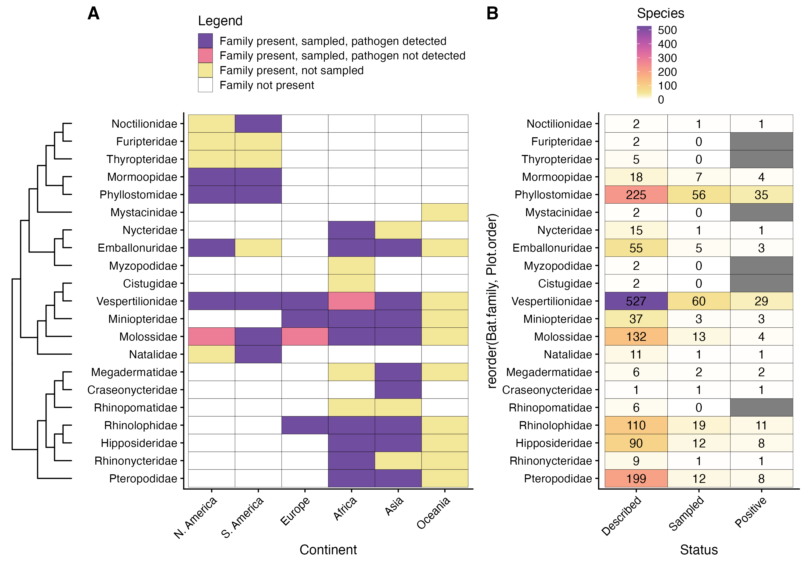

# bat_bacterial_pathogens_review

Files from Szentivanyi et al. (2023) Transbound Emerg Dis - Trends in bacterial pathogens of bats: global distribution and knowledge gaps

Review includes all studies of 11 zoonotic bacterial genera in bats published before October 2022.

Shape files for bat geographic ranges (and all other terrestrial mammals) are available from IUCN at https://www.iucnredlist.org/resources/spatial-data-download.

The main data file, 'new_Data_pat_ORIGINAL_2022_updated0310_nocoord.csv', is available by request ((clifton.mckee@gmail.com)[mailto:clifton.mckee@gmail.com]), as well as other large data files, 'mammterr.RData' and 'MAMMALS_TERRESTRIAL_ONLY.shp'.

